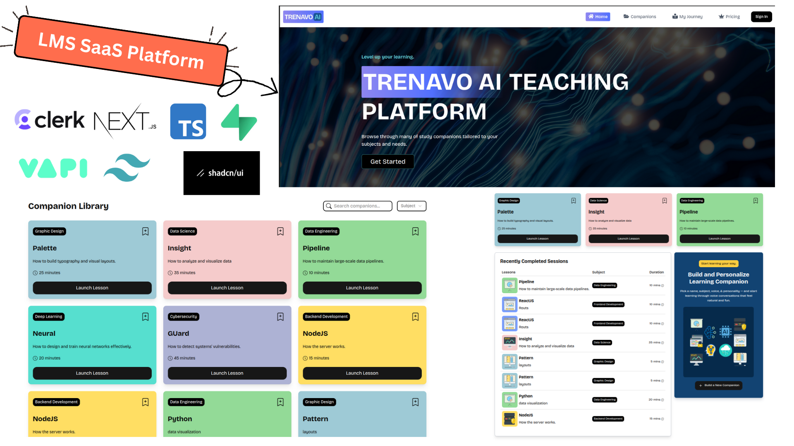
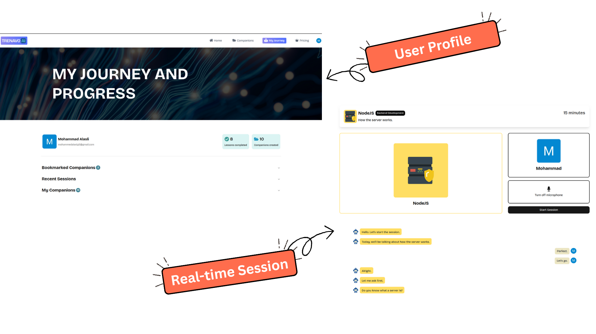

<header align=center>
 
</header>
<br />
<h1 align="center">
Trenavo: Real-time AI Teaching Platform
</h1>

<div align="center">
<h2>Tech Stack</h2>
  
  
  
  
  
  
</div>

<div align="center">

</div>
<br />
<br />
<br />
<br />

## Overview

Trenavo is a Learning Management System (LMS) SaaS application built with **Next.js**, **TypeScript**, **Supabase**, and **Clerk**. With the integration of **Vapi**'s AI vocal agent, Trenavo provides personalized and engaging learning sessions. Users can interact with Trenavo by creating sessions, choosing a subject, selecting the voice tone of the companion, and setting the session length. They can also bookmark companions and view their session history in their user profile, which includes bookmarked companions, completed sessions, and recent activity.

## Features

1.**Authentication & Subscriptions:** Secure and seamless user authentication with **Clerk**, along with flexible subscription plans and payment processing for easy access to premium content.

2.**AI-powered Learning:** Integration with **Vapi**'s AI vocal agent, delivering interactive learning experiences.

3.**Database Integration:** Powered by **Supabase** for real-time data handling and storage.

4.**Cross-Device Compatibility:** Fully responsive design that works seamlessly on any device.

5.**Search Functionality:** Find companions quickly with robust filters and search bar.

6.**Bookmarks and Session History:** Let users organize their learning by bookmarking companion and accessing.

7.**Creating Companions:** Create your own AI companion, choosing a subject, topic, and style of conversation.

<br />

<div align=center>
 
</div>

## Visit Live Site

🌐 <https://trenavo-ai.vercel.app/>

## 🚀 Quick Start

**Prerequisites** Make sure you have the following installed on your machine:

- [Git](https://git-scm.com/)
- [Node.js](https://nodejs.org/en)
- [npm](https://www.npmjs.com/) (Node Package Manager)

### 1. Clone the Repository

```bash
git clone https://github.com/mohammedalasly/SaaS-App.git
cd SaaS-App
```

### 2. Setup Environment Variables

- Create a `.env.local` file in the root of the project with the following variables
- Make sure to replace these with your actual credentials.

```bash
# Vapi
NEXT_PUBLIC_VAPI_WEB_TOKEN=

# Clerk
NEXT_PUBLIC_CLERK_PUBLISHABLE_KEY=
CLERK_SECRET_KEY=
NEXT_PUBLIC_CLERK_SIGN_IN_URL=/sign-in
NEXT_PUBLIC_CLERK_SIGN_IN_FALLBACK_REDIRECT_URL=/
NEXT_PUBLIC_CLERK_SIGN_UP_FALLBACK_REDIRECT_URL=/

# Supabase
NEXT_PUBLIC_SUPABASE_URL=
NEXT_PUBLIC_SUPABASE_ANON_KEY=
```

### 3. Install Dependencies

```bash
npm install
```

### 4. Run Locally

```bash
npm run dev
```

- Open <http://localhost:3000> in your browser to view the app.


